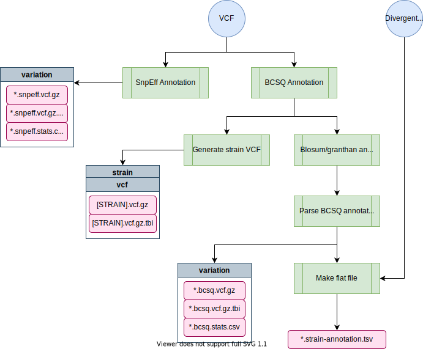

/badge.svg)

# annotation-nf

Annotate VCF with snpeff and bcsq


# Pipeline overview

```
-------------    
ANNOTATION-NF
-------------

nextflow main.nf --debug

nextflow main.nf --vcf=hard-filtered.vcf --species=c_elegans --divergent_regions=divergent_regions_strain.bed

    parameters           description                                              Set/Default
    ==========           ===========                                              ========================
    --debug              Set to 'true' to test                                    ${params.debug}
    --species            Species: 'c_elegans', 'c_tropicalis' or 'c_briggsae'     ${params.species}
    --vcf                hard filtered vcf to calculate variant density           ${params.vcf}
    --divergent_regions  (Optional) Divergent region bed file                     ${params.divergent_regions}
    --reference          Reference used based on species and project              ${params.reference}
    --output             (Optional) output folder name                            ${params.output}
 
    username                                                                      ${"whoami".execute().in.text}

    HELP: http://andersenlab.org/dry-guide/pipeline-annotation-nf
```



## Software Requirements

* The latest update requires Nextflow version 20.0+. On QUEST, you can access this version by loading the `nf20_env` conda environment prior to running the pipeline command:

```
module load python/anaconda3.6
source activate /projects/b1059/software/conda_envs/nf20_env
```

Alternatively you can update Nextflow by running:

```
nextflow self-update
```


# Usage

## Testing on Quest

*This command uses a test dataset*

```
nextflow run andersenlab/annotation-nf --debug
```

## Running on Quest

You should run this in a screen session.

```
nextflow run andersenlab/annotation-nf --vcf <path_to_vcf> --species <species> --divergent_regions <path_to_file>
```

# Parameters

## --debug

You should use `--debug true` for testing/debugging purposes. This will run the debug test set (located in the `test_data` folder).

For example:

```
nextflow run andersenlab/annotation-nf --debug
```

## --vcf

Path to the hard-filter, isotype VCF (output from `post-gatk-nf`)

## --species

Choose from c_elegans, c_briggsae, or c_tropicalis. Species will specifiy a default reference genome. You can select a different one if you prefer (see below)

## --divergent_regions

This is the `divergent_regions_strain.bed` file output from the `post-gatk-nf` pipeline. This file is used to add a column to the flat file if the variant is within a divergent region. Currently, *C. elegans* is the only species with divergent regions, if running for another species, do not provide a divergent_regions file and the pipeline will ignore it.

### --reference, --project, --ws_build (optional)

By default, the reference genome is set by the species parameter. If you don't want to use the default, you could change the project and/or ws_build. As long as the genome is in the proper location on quest (for more, see the [genomes-nf](pipeline-genomes-nf.md) pipeline), this will work. Alternatively, you could provide the path to a reference of your choice.

**Defaults:**
- *C. elegans* - `/projects/b1059/data/c_elegans/genomes/PRJNA13758/WS276/c_elegans.PRJNA13758.WS276.genome.fa.gz`
- *C. briggsae* - `/projects/b1059/data/c_briggsae/genomes/QX1410_nanopore/Feb2020/c_briggsae.QX1410_nanopore.Feb2020.genome.fa.gz`
- *C. tropicalis* - `/projects/b1059/data/c_tropicalis/genomes/NIC58_nanopore/June2021/c_tropicalis.NIC58_nanopore.June2021.genome.fa.gz`

### --ncsq_param (optional)

This parameter is necessary for correct annotation using BCSQ for variants with many different annotations (like found in divergent regions). In 20210121 we found that the default value of `224` was sufficient, but as more strains are added this number might need to increase. If there is an issue, you should see a warning error from BCFtools and they should suggest what to change this parameter to.

# CSQ compatible GFFs

There are a few specific change that need to be made to the GFF to use CSQ. These additions are made with the following script


```{}
library(tidyverse)


#gff_file <- "/projects/b1059/projects/Ryan/protein_structure/ben_1_convergence/annotate_cb/gffs/c_briggsae/test.gff"

fix_mRNA <- function(ID, Parent){
  transcript_id <- strsplit(ID, "=")[[1]][2]
  gene_id <- strsplit(Parent, "=")[[1]][2]
  
  new_at <- glue::glue("ID={transcript_id};Parent={gene_id};biotype=protein_coding")
  return(new_at)
} 


add_mrna_biotype <- function(gff_file, transcript_type = "mRNA"){
    
    gff_cols <- c("chrm_id", "source", "type", "start", "end", "score", "strand", "phase", "attributes") 
    
    gff <- data.table::fread(gff_file, header = FALSE, col.names = gff_cols)  #Separate the attribute column
    
    mrna_features <- gff  %>%
        dplyr::filter(type == transcript_type)  %>% 
        separate(attributes, sep=";", into = c("ID", "Parent")) %>% 
        dplyr::mutate(attributes = map2_chr(ID, Parent, fix_mRNA)) %>% 
        select(-ID, -Parent)

    #return(mrna_features)
    other_features <- gff  %>%
        dplyr::filter(type != transcript_type)  

    reformatted <- bind_rows(mrna_features, other_features)
    

    #name and save output file
    today <- format(Sys.time(), '%Y%m%d')
    file_id <- basename(gff_file)
    write_tsv(reformatted, glue::glue("{file_id}_reformatted_{today}.gff"), col_names = FALSE)
     


}

ct_gff = "/projects/b1059/projects/Ryan/protein_structure/ben_1_convergence/annotate_cb/gffs/c_tropicalis/NIC58.final_annotation.fixed.CSQ.gff"
cb_gff = "/projects/b1059/projects/Ryan/protein_structure/ben_1_convergence/annotate_cb/gffs/c_briggsae/Curation-VF-230214.PC.clean.renamed.csq.gff3"

#Transcript type allows the "type" column in the gff to be dynamic 
add_mrna_biotype(ct_gff, transcript_type = "transcript")
add_mrna_biotype(cb_gff, transcript_type = "mRNA")
```
As of 05/02/23 these files are in the respective genomes folder on quest

# Output

```
├── strain_vcf
│   ├── {strain}.{date}.vcf.gz
│   └── {strain}.{date}.vcf.gz.tbi
└── variation
    ├── WI.{date}.hard-filter.isotype.snpeff.vcf.gz
    ├── WI.{date}.hard-filter.isotype.snpeff.vcf.gz.tbi
    ├── snpeff.stats.csv
    ├── WI.{date}.hard-filter.isotype.bcsq.vcf.gz
    ├── WI.{date}.hard-filter.isotype.bcsq.vcf.gz.tbi
    ├── WI.{date}.hard-filter.isotype.bcsq.vcf.gz.stats.txt 
    └── WI.{date}.strain-annotation.bcsq.tsv
 
```

# Relevant Docker Images

* `andersenlab/annotation` ([link](https://hub.docker.com/r/andersenlab/annotation)): Docker image is created within this pipeline using GitHub actions. Whenever a change is made to `env/annotation.Dockerfile` or `.github/workflows/build_docker.yml` GitHub actions will create a new docker image and push if successful
* `andersenlab/r_packages` ([link](https://hub.docker.com/r/andersenlab/r_packages)): Docker image is created manually, code can be found in the [dockerfile](https://github.com/AndersenLab/dockerfile/tree/master/r_packages) repo.
